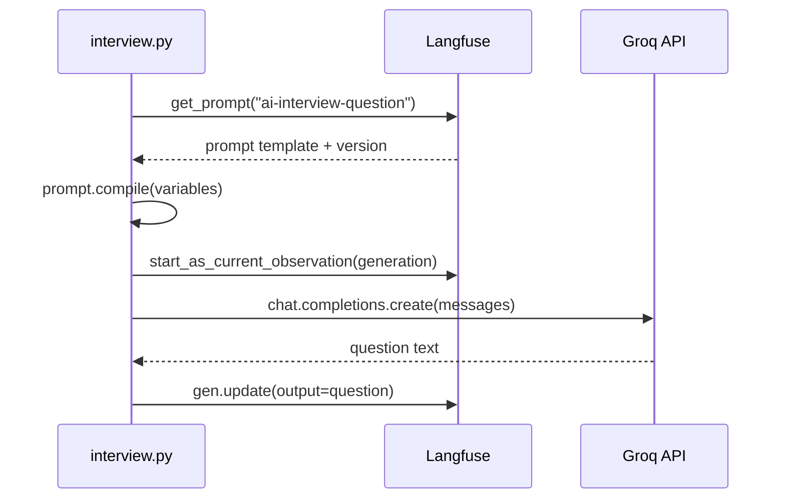

# AI Interview Simulator — Architecture & Code Flow

This document describes the full architecture of the AI Interview Simulator: how the frontend, backend, Groq LLM, and Langfuse observability layer work together from application startup through interview completion.

---

## Table of contents

1. [Overview](#1-overview)
2. [Technology stack](#2-technology-stack)
3. [Project structure](#3-project-structure)
4. [High-level architecture](#4-high-level-architecture)
5. [Entry points](#5-entry-points)
6. [Identifiers and state](#6-identifiers-and-state)
7. [Bootstrap and setup](#7-bootstrap-and-setup)
8. [Complete code flow — start to end (with files)](#8-complete-code-flow--start-to-end-with-files)
9. [Web UI code flow (phases)](#9-web-ui-code-flow-phases)
10. [REST API reference](#10-rest-api-reference)
11. [Backend orchestration layer](#11-backend-orchestration-layer)
12. [Interview engine (core logic)](#12-interview-engine-core-logic)
13. [LLM integration (Groq)](#13-llm-integration-groq)
14. [Langfuse observability](#14-langfuse-observability)
15. [Terminal CLI flow](#15-terminal-cli-flow)
16. [Communication summary](#16-communication-summary)
17. [Sequence diagrams](#17-sequence-diagrams)
18. [Environment variables](#18-environment-variables)
19. [Data flow](#19-data-flow)
20. [Validation](#20-validation)
21. [Timer configuration](#21-timer-configuration)
22. [`interview.py` vs `interview_service.py`](#22-interviewpy-vs-interview_servicepy)

---

## 1. Overview

The application simulates a **technical job interview**:

1. The candidate enters their **name**, **role**, **difficulty**, and **number of questions**.
2. The backend generates adaptive interview questions using a **Groq LLM**.
3. The candidate answers under a **countdown timer** (per difficulty); answers can be **draft-saved** in the browser.
4. Each answer is **evaluated** by the LLM (score 0–10 plus feedback).
5. After the last question, a **final report** is generated (viewable, printable, exportable as JSON).
6. Every LLM call and user interaction is **traced in Langfuse** for observability.

The system has two ways to run:

| Mode | Entry | User interface | State handling |
|------|-------|----------------|----------------|
| **Web** | `backend/app/api.py` | React app on port 5173 | In-memory store across HTTP requests |
| **Terminal** | `backend/app/main.py` | stdin/stdout CLI | Single synchronous Python process |

Both modes share the same core interview logic (`interview.py`, `evaluator.py`, `memory.py`) and Langfuse instrumentation.

---

## 2. Technology stack

| Layer | Technology | Purpose |
|-------|------------|---------|
| Frontend | React 19 + Vite | Setup, timed Q&A, report, step indicator, toasts |
| API | FastAPI + Uvicorn | REST endpoints, CORS, Pydantic validation |
| LLM | Groq (OpenAI-compatible API) | Question gen, evaluation, final report |
| Observability | Langfuse SDK v4 | Traces, observations, sessions, scores, prompts |
| Server state | In-memory Python dict | Active interviews (web mode only) |
| Client state | `localStorage` | Setup prefs + per-question answer drafts |
| Config | python-dotenv | `.env` loading from `backend/` or project root |

---

## 3. Project structure

```
AI Interview/
├── docs/
│   └── ARCHITECTURE.md          ← this file
├── backend/
│   ├── app/
│   │   ├── api.py               # FastAPI REST API (web entry)
│   │   ├── main.py              # Terminal CLI entry
│   │   ├── config.py            # Env file paths
│   │   ├── constants.py         # Roles & difficulties
│   │   ├── prompts.py           # Langfuse prompt name constants
│   │   ├── core/
│   │   │   ├── interview.py     # Question/report generation + CLI runner
│   │   │   ├── interview_service.py  # Web step-based orchestration
│   │   │   ├── evaluator.py     # Answer evaluation LLM call
│   │   │   ├── memory.py        # InterviewState, QAItem, Evaluation
│   │   │   ├── groq_client.py   # Groq API client + fallbacks
│   │   │   ├── langfuse_utils.py # Langfuse client + session IDs
│   │   │   ├── timer_config.py  # Per-question seconds by difficulty
│   │   │   └── utils.py         # CLI helpers, JSON parsing, spinner
│   │   └── store/
│   │       └── session_store.py # In-memory ActiveInterview store
│   ├── seed_prompts.py          # One-time Langfuse prompt seeding
│   ├── requirements.txt
│   └── .session_counter         # Persistent sequential session counter
├── frontend/
│   └── src/
│       ├── main.jsx             # React mount point
│       ├── App.jsx              # Screen router, toast, beforeunload guard
│       ├── api.js               # HTTP client + health check
│       ├── components/
│       │   ├── Setup.jsx        # Name, role, difficulty, API status
│       │   ├── Interview.jsx    # Q&A, timer, drafts, timeout submit
│       │   ├── InterviewTimer.jsx  # Countdown UI + hook
│       │   ├── Report.jsx       # Results, export, top-3 actions
│       │   ├── FinalReportPanel.jsx
│       │   ├── StepIndicator.jsx    # Header: Setup → Interview → Report
│       │   ├── HeaderSessionMenu.jsx # Candidate name, session/interview IDs
│       │   ├── Toast.jsx
│       │   └── icons.jsx
│       └── utils/
│           ├── storage.js       # localStorage prefs + answer drafts
│           ├── timerConfig.js     # Mirror of backend timer rules
│           ├── parseReport.js     # Markdown → structured sections
│           └── reportExport.js    # JSON download, print, top-3 actions
└── README.md
```

---

## 4. High-level architecture

```
┌─────────────────────────────────────────────────────────────────────────┐
│                         FRONTEND (React + Vite)                          │
│  App.jsx ──► Setup | Interview | Report                                   │
│  StepIndicator, HeaderSessionMenu, Toast                                │
│  InterviewTimer (in Interview.jsx) · storage.js (localStorage)          │
│                    └──────────────────────────────► api.js (fetch)        │
└────────────────────────────────────┬────────────────────────────────────┘
                                     │ HTTP (JSON)
                                     ▼
┌─────────────────────────────────────────────────────────────────────────┐
│                         BACKEND (FastAPI)                                │
│  api.py ──► interview_service.py ──► interview.py / evaluator.py        │
│                    │                                                     │
│                    └──► session_store.py (in-memory state)              │
└──────────┬──────────────────────────────┬─────────────────────────────────┘
           │                              │
           ▼                              ▼
┌──────────────────────┐      ┌──────────────────────────────────────────┐
│   Groq API (LLM)     │      │   Langfuse Cloud                          │
│   groq_client.py     │      │   langfuse_utils.py + seed_prompts.py     │
│                      │      │   • Traces / Observations / Sessions       │
│                      │      │   • Scores / Prompt Management             │
└──────────────────────┘      └──────────────────────────────────────────┘
```

**Communication pattern (web mode):**

- Frontend ↔ Backend: **stateless HTTP** (JSON request/response).
- Frontend ↔ `localStorage`: **setup prefs** and **answer drafts** (no server sync).
- Backend ↔ Groq: **synchronous LLM API calls** per question/evaluation/report.
- Backend ↔ Langfuse: **async batched telemetry** (`flush()` after each API handler).
- Backend internal: **in-memory store** ties multiple HTTP requests to one interview via `interview_id`.

### Product features (current)

| Feature | Primary files |
|---------|----------------|
| Candidate name + welcome message | `Setup.jsx`, `interview_service.py` (`build_welcome_message`) |
| Interview countdown timer | `timer_config.py`, `timerConfig.js`, `InterviewTimer.jsx`, `Interview.jsx` |
| Timeout auto-submit | `Interview.jsx` → placeholder `[No answer submitted — time expired]` |
| Answer draft autosave | `storage.js`, `Interview.jsx` (500ms debounce) |
| Setup prefs persistence | `storage.js`, `Setup.jsx` |
| API health indicator | `api.js` (`checkHealth`), `Setup.jsx` (30s poll) |
| Step indicator in header | `StepIndicator.jsx`, `App.jsx` |
| Session menu (name, IDs) | `HeaderSessionMenu.jsx`, `App.jsx` |
| Global + urgent toasts | `Toast.jsx`, `App.jsx`, `Interview.jsx` |
| Leave-page warning | `App.jsx` (`beforeunload` while interview active) |
| Report export / print | `reportExport.js`, `Report.jsx` |
| Top 3 improvement actions | `reportExport.js` (`getTop3Actions`), `Report.jsx` |

---

## 5. Entry points

### Web API

```bash
cd backend
uvicorn app.api:app --reload --port 8000
```

- File: `backend/app/api.py`
- Creates FastAPI app with CORS for `http://localhost:5173`
- Delegates all business logic to `interview_service.py`

### Terminal CLI

```bash
cd backend
python -m app.main
```

- File: `backend/app/main.py`
- Prompts user in terminal for role, difficulty, question count
- Calls `run_interview()` in `interview.py` — entire interview in one process

### Frontend dev server

```bash
cd frontend
npm run dev
```

- Serves React app at `http://localhost:5173`
- Proxies or calls backend at `http://localhost:8000` (via `VITE_API_URL` or same-origin)

---

## 6. Identifiers and state

The application uses three distinct IDs. Understanding them is key to following the code flow.

| ID | Format | Created in | Purpose |
|----|--------|------------|---------|
| **`session_id`** | Sequential string (`"1"`, `"2"`, …) | `langfuse_utils.py` → `new_session_id()` | Langfuse **Sessions** UI grouping |
| **`interview_id`** | UUID hex | `session_store.py` → `new_interview_id()` | REST API routing; key in in-memory store |
| **`trace_id`** | Langfuse trace ID | `langfuse.create_trace_id(seed=session_id)` | Links all Langfuse observations for one interview |

**In-memory state (web mode):**

```python
# session_store.py
ActiveInterview(
    interview_id,      # API key
    trace_id,          # Langfuse trace continuity
    state,             # InterviewState (Q&A history)
    langfuse,          # Langfuse client instance
    llm_client,        # Groq OpenAI client
    model,             # e.g. llama-3.3-70b-versatile
    current_question,
    current_question_number,
    status,            # "in_progress" | "completed"
    final_report,      # set when completed
)
```

**Interview state (shared by web + CLI):**

```python
# memory.py
InterviewState(
    session_id,
    role,
    difficulty,
    n_questions,
    candidate_name="",  # displayed in UI and report
    items=[],           # list of QAItem after each answer
)
```

**Client-side state (web only):**

| Storage | Key / content | File |
|---------|---------------|------|
| React `session` | Current interview API payload | `App.jsx` |
| Setup prefs | `ai-interview-setup-prefs` — name, role, difficulty, nQuestions | `storage.js` |
| Answer drafts | `ai-interview-draft-{interviewId}-q{N}` | `storage.js` |

---

## 7. Bootstrap and setup

Before running interviews, prompts must exist in Langfuse.

### Step 1: Environment

Files loaded by `config.py` → `load_env()`:

1. `backend/.env`
2. Project root `.env` (fallback)

Required variables: `GROQ_API_KEY`, `LANGFUSE_PUBLIC_KEY`, `LANGFUSE_SECRET_KEY`.

### Step 2: Seed prompts

```bash
cd backend
python seed_prompts.py
```

| File | Action |
|------|--------|
| `seed_prompts.py` | Calls `make_langfuse()` then `langfuse.create_prompt()` three times |
| `prompts.py` | Defines prompt names used at runtime |

Prompts created:

| Name constant | Langfuse name | Used for |
|---------------|---------------|----------|
| `QUESTION_PROMPT_NAME` | `ai-interview-question` | Generate next question |
| `EVALUATION_PROMPT_NAME` | `ai-interview-evaluate` | Grade candidate answer |
| `FINAL_REPORT_PROMPT_NAME` | `ai-interview-final-report` | End-of-interview summary |

At runtime, the app **never hardcodes prompt text** — it fetches via `langfuse.get_prompt(name, type="chat")` and compiles template variables.

---

## 8. Complete code flow — start to end (with files)

This section is the **master walkthrough**: every step from opening the browser to viewing the final report, with the exact source file(s) involved at each hop.

### Part 0 — One-time developer setup (before first interview)

| # | Action | File(s) involved |
|---|--------|------------------|
| 0.1 | Load API keys from disk | `backend/app/config.py` → reads `backend/.env` or project root `.env` |
| 0.2 | Seed prompts into Langfuse | `backend/seed_prompts.py` |
| 0.3 | Prompt name constants | `backend/app/prompts.py` (`QUESTION_PROMPT_NAME`, `EVALUATION_PROMPT_NAME`, `FINAL_REPORT_PROMPT_NAME`) |
| 0.4 | Create Langfuse client | `backend/app/core/langfuse_utils.py` → `make_langfuse()` |
| 0.5 | Upload 3 chat prompts | `backend/seed_prompts.py` → `langfuse.create_prompt(...)` × 3 |
| 0.6 | Flush to Langfuse Cloud | `backend/seed_prompts.py` → `langfuse.flush()` |

### Part 1 — Start servers

| # | Action | File(s) involved |
|---|--------|------------------|
| 1.1 | Start FastAPI backend | `backend/app/api.py` (via `uvicorn app.api:app`) |
| 1.2 | Load env on API startup | `backend/app/api.py` → `load_env()` from `backend/app/config.py` |
| 1.3 | Register CORS + routes | `backend/app/api.py` |
| 1.4 | Start Vite dev server | `frontend/vite.config.js`, `frontend/index.html` |
| 1.5 | Mount React app | `frontend/src/main.jsx` → renders `frontend/src/App.jsx` |

### Part 2 — User opens app (Setup screen)

| # | Action | File(s) involved |
|---|--------|------------------|
| 2.1 | App sets initial screen | `frontend/src/App.jsx` — `screen = "setup"`, `session = null`, `Toast` |
| 2.2 | Render header chrome | `App.jsx` → `StepIndicator.jsx`, `HeaderSessionMenu.jsx` |
| 2.3 | Render setup form | `App.jsx` → `frontend/src/components/Setup.jsx` |
| 2.4 | Restore saved prefs | `Setup.jsx` → `loadSetupPrefs()` in `utils/storage.js` |
| 2.5 | Poll API health | `Setup.jsx` → `checkHealth()` in `api.js` → `GET /api/health` (every 30s) |
| 2.6 | Fetch roles on mount | `Setup.jsx` → `getRoles()` in `api.js` |
| 2.7 | HTTP GET roles | `api.js` → `GET /api/roles` → `api.py` → `constants.py` |
| 2.8 | Show timer estimate | `Setup.jsx` → `getTimerEstimate()` in `utils/timerConfig.js` |
| 2.9 | Autosave prefs (debounced) | `Setup.jsx` → `saveSetupPrefs()` in `storage.js` |

### Part 3 — User clicks "Begin Interview" (start interview)

| # | Action | File(s) involved |
|---|--------|------------------|
| 3.1 | Form submit handler | `frontend/src/components/Setup.jsx` → `handleSubmit()` |
| 3.2 | Call start API | `Setup.jsx` → `startInterview()` in `frontend/src/api.js` |
| 3.3 | Validate name + role (UI) | `Setup.jsx` — name required, role required, API online |
| 3.4 | HTTP POST | `api.js` → `POST /api/interviews` with `{ candidate_name, role, difficulty, n_questions }` |
| 3.5 | Validate request body | `backend/app/api.py` → Pydantic `StartInterviewRequest` (`candidate_name` 1–100 chars) |
| 3.6 | Route to service | `api.py` → `create_interview()` → `start_interview()` |
| 3.7 | Create Langfuse client | `interview_service.py` → `make_langfuse()` in `langfuse_utils.py` |
| 3.8 | Create Groq client | `interview_service.py` → `make_groq_client()` in `groq_client.py` |
| 3.9 | Assign session ID | `interview_service.py` → `new_session_id()` (writes `backend/.session_counter`) |
| 3.10 | Create Langfuse trace | `interview_service.py` → `langfuse.create_trace_id(seed=session_id)` |
| 3.11 | Validate candidate name | `interview_service.py` — non-empty after `.strip()` |
| 3.12 | Build interview state | `interview_service.py` → `InterviewState(..., candidate_name=name)` in `memory.py` |
| 3.13 | Open Langfuse session | `interview_service.py` → `propagate_attributes(session_id=...)` (metadata includes `candidate_name`) |
| 3.14 | Open root span | `interview_service.py` → `start_as_current_observation(name="interview_session")` |
| 3.15 | Generate question 1 | `interview_service.py` → `generate_question()` in `interview.py` |
| 3.16 | Fetch prompt from Langfuse | `interview.py` → `langfuse.get_prompt(QUESTION_PROMPT_NAME)` — `prompts.py` |
| 3.17 | Compile + LLM call | `interview.py` → Groq via `groq_client.py` |
| 3.18 | Store active interview | `session_store.py` → `store.create(ActiveInterview(...))` |
| 3.19 | Compute timer config | `interview_service.py` → `get_timer_config()` in `timer_config.py` |
| 3.20 | Flush Langfuse | `interview_service.py` → `langfuse.flush()` |
| 3.21 | Return JSON | Includes `candidate_name`, `welcome_message`, `per_question_seconds`, `total_seconds`, Q1, IDs |
| 3.22 | Switch to interview | `Setup.jsx` → `onStart(data)` → `App.jsx` → `screen = "interview"` → `Interview.jsx` |

### Part 4 — Interview loop (repeat for each question)

Each iteration covers: **display question → user answers → evaluate → score → next question OR finish**.

#### 4A — Display current question

| # | Action | File(s) involved |
|---|--------|------------------|
| 4A.1 | Render interview UI | `App.jsx` → `Interview.jsx`; `onInterviewActive(true)` for beforeunload |
| 4A.2 | Welcome banner (Q1) | `Interview.jsx` — `session.welcome_message`; dismiss or auto-start timer after 5s |
| 4A.3 | Load answer draft | `Interview.jsx` → `loadDraft()` in `storage.js` |
| 4A.4 | Autosave draft (500ms) | `Interview.jsx` → `saveDraft()` in `storage.js` |
| 4A.5 | Countdown timer | `InterviewTimer.jsx` + `useInterviewCountdown` + `timerConfig.js` |
| 4A.6 | Show question + progress | `Interview.jsx` — question, step dots, progress bar |

#### 4B — User submits an answer (manual or timeout)

| # | Action | File(s) involved |
|---|--------|------------------|
| 4B.1 | Manual submit | `Interview.jsx` → `submitAnswerFlow({ timedOut: false })` via form or Ctrl+Enter |
| 4B.2 | Timer expire | `Interview.jsx` → `handleExpire()` → `submitAnswerFlow({ timedOut: true })` |
| 4B.3 | Client validation | Non-empty answer unless timed out → then `[No answer submitted — time expired]` |
| 4B.4 | Call submit API | `Interview.jsx` → `submitAnswer()` in `api.js` |
| 4B.3 | HTTP POST | `api.js` → `POST /api/interviews/{interview_id}/answers` |
| 4B.4 | Validate body | `backend/app/api.py` → `SubmitAnswerRequest` |
| 4B.5 | Route to service | `api.py` → `post_answer()` → `submit_answer()` in `interview_service.py` |
| 4B.6 | Load interview from store | `interview_service.py` → `store.get(interview_id)` in `session_store.py` |
| 4B.7 | Re-attach Langfuse session | `interview_service.py` → `propagate_attributes(session_id=...)` |
| 4B.8 | Record user answer span | `interview_service.py` → `start_as_current_observation(name="accept_user_answer")` |

#### 4C — Evaluate the answer (every submission)

| # | Action | File(s) involved |
|---|--------|------------------|
| 4C.1 | Call evaluator | `interview_service.py` → `evaluate_answer()` in `evaluator.py` |
| 4C.2 | Fetch eval prompt | `evaluator.py` → `langfuse.get_prompt(EVALUATION_PROMPT_NAME)` — `prompts.py` |
| 4C.3 | Compile with Q + A | `evaluator.py` → `prompt.compile(question, answer, ...)` |
| 4C.4 | Record generation | `evaluator.py` → `start_as_current_observation(as_type="generation", name="evaluate_answer")` |
| 4C.5 | Call Groq API | `evaluator.py` → `chat_completion_with_fallbacks()` in `groq_client.py` |
| 4C.6 | Parse JSON response | `evaluator.py` → `safe_json_loads()` in `utils.py` |
| 4C.7 | Build Evaluation object | `evaluator.py` → `Evaluation(...)` in `memory.py` |
| 4C.8 | Score in Langfuse | `interview_service.py` → `langfuse.create_score(name="answer_score")` |
| 4C.9 | Append to history | `interview_service.py` → `state.add_item(QAItem(...))` in `memory.py` |

#### 4D — Branch: more questions OR finish

**If NOT the last question:**

| # | Action | File(s) involved |
|---|--------|------------------|
| 4D.1 | Generate next question | `interview_service.py` → `generate_question()` in `interview.py` |
| 4D.2 | (same as 3.14–3.17) | `interview.py` → Langfuse prompt → Groq via `groq_client.py` |
| 4D.3 | Update store | `interview_service.py` → updates `active.current_question`, `current_question_number` in `session_store.py` |
| 4D.4 | Flush + return next Q | `interview_service.py` → `langfuse.flush()` → JSON to `Interview.jsx` |
| 4D.5 | Clear draft for completed Q | `Interview.jsx` → `clearDraft()` in `storage.js` |
| 4D.6 | Update UI | `Interview.jsx` — new question, increment number, clear textarea, reset timer |
| 4D.7 | Loop back | Go to **4A** for next question |

**If LAST question:**

| # | Action | File(s) involved |
|---|--------|------------------|
| 4E.1 | Generate final report | `interview_service.py` → `generate_final_report()` in `interview.py` |
| 4E.2 | Fetch report prompt | `interview.py` → `langfuse.get_prompt(FINAL_REPORT_PROMPT_NAME)` — `prompts.py` |
| 4E.3 | Compile transcript | `interview.py` → uses `_transcript(state)` + `InterviewState` from `memory.py` |
| 4E.4 | Record generation | `interview.py` → `start_as_current_observation(name="final_report")` |
| 4E.5 | Call Groq API | `interview.py` → `groq_client.py` |
| 4E.6 | Build FinalReport | `interview.py` → `FinalReport` dataclass; recommendation via `_recommendation()` |
| 4E.7 | Overall score in Langfuse | `interview.py` → `langfuse.create_score(name="overall_score")` |
| 4E.8 | Mark completed | `interview_service.py` → `active.status = "completed"`, `active.final_report = report` |
| 4E.9 | Flush + return | `interview_service.py` → `langfuse.flush()` → `{ completed: true }` to `Interview.jsx` |
| 4E.10 | Navigate to report | `Interview.jsx` → `onComplete(interview_id)` → `App.jsx` → `screen = "report"` |

### Part 5 — Report screen

| # | Action | File(s) involved |
|---|--------|------------------|
| 5.1 | Render report page | `frontend/src/App.jsx` → `frontend/src/components/Report.jsx` |
| 5.2 | Fetch report on mount | `Report.jsx` → `fetchReport()` in `frontend/src/api.js` |
| 5.3 | HTTP GET | `api.js` → `GET /api/interviews/{interview_id}/report` |
| 5.4 | API handler | `backend/app/api.py` → `fetch_report()` → `get_report()` in `interview_service.py` |
| 5.5 | Read from store | `interview_service.py` → `store.get()` → `ActiveInterview.final_report`, `state.items` |
| 5.6 | Serialize response | `interview_service.py` → `qa_item_to_dict()`, `final_report_to_dict()` |
| 5.7 | Display per-question feedback | `Report.jsx` — maps `per_question_feedback` |
| 5.8 | Parse final report markdown | `FinalReportPanel.jsx` → `mergeReportData()` in `utils/parseReport.js` |
| 5.9 | Top 3 actions + export | `Report.jsx` → `getTop3Actions()`, `downloadReportJson()`, `printReport()` in `reportExport.js` |
| 5.10 | User restarts | `Report.jsx` → `onRestart()` → `App.jsx` clears session; `clearInterviewDrafts()` already ran on complete |

### Part 6 — File chain summary (single line per major action)

```
Browser open
  → main.jsx → App.jsx → Setup.jsx
  → api.js → api.py → constants.py

Begin interview
  → Setup.jsx → api.js → api.py → interview_service.py
  → langfuse_utils.py + groq_client.py + memory.py + timer_config.py
  → interview.py → Langfuse + Groq → session_store.py
  → App.jsx → Interview.jsx (+ InterviewTimer.jsx, storage.js)

Submit answer (×N)
  → Interview.jsx (timer / draft / submitAnswerFlow) → api.js → api.py
  → interview_service.py → session_store.py → evaluator.py → interview.py
  → storage.js (clearDraft) → Interview.jsx loop or App.jsx → Report.jsx

View report
  → Report.jsx → api.js → interview_service.py → session_store.py
  → FinalReportPanel.jsx + reportExport.js
```

### Part 7 — Langfuse touchpoints per step (files only)

| Langfuse action | File |
|-----------------|------|
| Create client | `langfuse_utils.py` |
| Session ID | `langfuse_utils.py` → `.session_counter` |
| Seed prompts | `seed_prompts.py` |
| Prompt names | `prompts.py` |
| `get_prompt` + `compile` | `interview.py`, `evaluator.py` |
| `create_trace_id` | `interview_service.py`, `interview.py` (CLI) |
| `propagate_attributes(session_id)` | `interview_service.py`, `interview.py` |
| Span `interview_session` | `interview_service.py`, `interview.py` |
| Span `accept_user_answer` | `interview_service.py`, `interview.py` |
| Generation `generate_question` | `interview.py` |
| Generation `evaluate_answer` | `evaluator.py` |
| Generation `final_report` | `interview.py` |
| Score `answer_score` | `interview_service.py`, `interview.py` |
| Score `overall_score` | `interview.py` |
| `flush()` | `interview_service.py`, `interview.py`, `main.py`, `seed_prompts.py` |

---

## 9. Web UI code flow (phases)

This section groups the same journey into high-level phases. For step-by-step file references, see [§8 Complete code flow](#8-complete-code-flow--start-to-end-with-files).

### Phase A — Application load

| Step | File(s) | What happens |
|------|---------|--------------|
| A1 | `frontend/src/main.jsx` | Mounts React root |
| A2 | `frontend/src/App.jsx` | `screen = "setup"`, `session = null`, toast state |
| A3 | `App.jsx` | Header: logo, `StepIndicator`, `HeaderSessionMenu`; footer; global `Toast` |
| A4 | `App.jsx` | Renders `<Setup onStart={handleStart} onError={showToast} />` |

### Phase B — Setup screen

| Step | File(s) | What happens |
|------|---------|--------------|
| B1 | `frontend/src/components/Setup.jsx` | `useEffect` on mount calls `getRoles()` |
| B2 | `frontend/src/api.js` | `GET /api/roles` |
| B3 | `backend/app/api.py` → `backend/app/constants.py` | Handler returns `{ roles, difficulties }` |
| B4 | `frontend/src/components/Setup.jsx` | Populates role dropdown and difficulty pills |
| B5 | User | Enters name; selects role, difficulty, question count; clicks **Begin Interview** |
| B6 | `frontend/src/components/Setup.jsx` | `handleSubmit` → `startInterview({ candidate_name, role, difficulty, n_questions })` |
| B7 | `frontend/src/api.js` | `POST /api/interviews` with JSON body |
| B8 | `backend/app/api.py` | Validates body via Pydantic `StartInterviewRequest`; calls `start_interview()` |
| B9 | `backend/app/core/interview_service.py` | See [§11.1 Start interview](#111-start_interview) |
| B10 | `frontend/src/components/Setup.jsx` | Receives response; calls `onStart(data)` |
| B11 | `frontend/src/App.jsx` | `handleStart(data)` sets `session = data`, `screen = "interview"` |
| B12 | `HeaderSessionMenu.jsx` | After start, shows candidate name, session ID, interview ID |

**Response shape from start interview:**

```json
{
  "interview_id": "abc123...",
  "session_id": "5",
  "candidate_name": "Alex",
  "welcome_message": "Hello Alex, welcome to your Python Developer interview round. Best of luck!",
  "question_number": 1,
  "total_questions": 5,
  "question": "Explain the difference between ...",
  "role": "Python Developer",
  "difficulty": "Medium",
  "per_question_seconds": 480,
  "total_seconds": 2400
}
```

### Phase C — Interview loop (repeated per question)

| Step | File(s) | What happens |
|------|---------|--------------|
| C1 | `App.jsx` → `Interview.jsx` | Renders interview screen; registers `beforeunload` guard |
| C2 | `Interview.jsx` | State from `session`; loads draft; starts timer after welcome |
| C3 | User | Types answer; submits manually or timer expires |
| C4 | `Interview.jsx` | `submitAnswerFlow()` → `submitAnswer(interview_id, text)` |
| C5 | `frontend/src/api.js` | `POST /api/interviews/{interview_id}/answers` with `{ "answer": "..." }` |
| C6 | `backend/app/api.py` | Validates via `SubmitAnswerRequest`; calls `submit_answer()` |
| C7 | `backend/app/core/interview_service.py` → `evaluator.py` / `interview.py` | See [§11.2 Submit answer](#112-submit_answer) |
| C8 | `frontend/src/components/Interview.jsx` | If `result.completed === true` → `onComplete(interview_id)` |
| C9 | `frontend/src/components/Interview.jsx` | Else: updates `question`, `question_number`, clears answer textarea |
| C10 | Loop | Returns to C3 until all questions answered |

**Response when not completed:**

```json
{
  "completed": false,
  "question_number": 2,
  "total_questions": 5,
  "question": "What is a decorator in Python?"
}
```

**Response when completed:**

```json
{
  "completed": true,
  "question_number": 5,
  "total_questions": 5
}
```

### Phase D — Report screen

| Step | File(s) | What happens |
|------|---------|--------------|
| D1 | `frontend/src/App.jsx` | `handleComplete` sets `screen = "report"` |
| D2 | `frontend/src/components/Report.jsx` | `useEffect` → `fetchReport(interviewId)` via `api.js` |
| D3 | `frontend/src/api.js` | `GET /api/interviews/{interview_id}/report` |
| D4 | `backend/app/api.py` → `backend/app/core/interview_service.py` | Calls `get_report()` |
| D5 | `backend/app/store/session_store.py` | Reads `ActiveInterview.final_report` and `state.items` |
| D6 | `frontend/src/components/Report.jsx` | Renders score circle, per-question feedback accordion |
| D7 | `frontend/src/components/FinalReportPanel.jsx` → `frontend/src/utils/parseReport.js` | Parses LLM markdown via `mergeReportData()` |
| D8 | `frontend/src/App.jsx` | User clicks **Start New Interview** → `onRestart()` → back to Phase A/B |

**Note:** The final report is **generated during the last `submit_answer` call**, not when fetching the report. The report endpoint only reads stored data.

---

## 10. REST API reference

Base URL: `http://localhost:8000` (default)

| Method | Path | Request body | Handler | Service function |
|--------|------|--------------|---------|------------------|
| `GET` | `/api/health` | — | `api.py` | inline |
| `GET` | `/api/roles` | — | `api.py` | inline (`constants.py`) |
| `POST` | `/api/interviews` | `{ candidate_name, role, difficulty, n_questions }` | `api.py` | `start_interview()` |
| `POST` | `/api/interviews/{id}/answers` | `{ answer }` | `api.py` | `submit_answer()` |
| `GET` | `/api/interviews/{id}/report` | — | `api.py` | `get_report()` |

**Frontend HTTP client:** `frontend/src/api.js`

- Uses `fetch()` with JSON headers
- Base URL from `import.meta.env.VITE_API_URL` (empty string = same origin)
- Throws on non-OK responses with `detail` from FastAPI error body
- `checkHealth()` — `GET /api/health` with 5s timeout (used by Setup screen)

**`StartInterviewRequest` validation (Pydantic):**

| Field | Rules |
|-------|--------|
| `candidate_name` | Required, 1–100 characters |
| `role` | Required string |
| `difficulty` | `Easy` \| `Medium` \| `Hard` |
| `n_questions` | 1–20 (default 5) |

**Error handling in `api.py`:**

| Exception | HTTP status |
|-----------|-------------|
| `KeyError` (interview not found) | 404 |
| `ValueError` (empty name/answer, already completed) | 400 |
| Other exceptions | 500 |

---

## 11. Backend orchestration layer

File: `backend/app/core/interview_service.py`

This file bridges the REST API and the core interview engine. It manages Langfuse trace continuity across multiple HTTP requests.

### 11.1 `start_interview()`

```
1. make_langfuse() + make_groq_client()
2. sid = new_session_id(); trace_id = create_trace_id(seed=sid)
3. Validate candidate_name (non-empty after strip)
4. InterviewState(..., candidate_name=name)
5. propagate_attributes(session_id=sid):
     span "interview_session" (metadata includes candidate_name)
     generate_question(..., question_number=1)
6. store.create(ActiveInterview(...))
7. timer = get_timer_config(difficulty, n_questions)  → timer_config.py
8. langfuse.flush()
9. Return JSON: ids, candidate_name, welcome_message, Q1, timer seconds, role, difficulty
```

**Langfuse at start:** Creates session context, root span, and first `generate_question` generation observation.

### 11.2 `submit_answer()`

```
1. active = store.get(interview_id)   → session_store.py
2. Validate: exists, not completed, answer non-empty
3. trace_context = { "trace_id": active.trace_id }
4. propagate_attributes(session_id=active.state.session_id):
   a. span "accept_user_answer" (input: question, output: answer)
   b. evaluate_answer(...)           → evaluator.py
   c. create_score("answer_score", value=ev.score)
   d. state.add_item(QAItem(...))    → memory.py
   e. IF last question:
        generate_final_report(...)   → interview.py
        create_score("overall_score")
        active.status = "completed"
      ELSE:
        generate_question(..., next_num)
        Update active.current_question / current_question_number
5. langfuse.flush()
6. Return { completed, question?, ... }
```

**Trace continuity:** Each HTTP request re-attaches observations to the **same trace** via `trace_context={"trace_id": active.trace_id}` stored in `ActiveInterview`.

### 11.3 `get_report()`

```
1. active = store.get(interview_id)
2. Validate: exists, status == "completed", final_report present
3. Serialize state.items → per_question_feedback
4. Serialize final_report → final_report dict
5. Return combined JSON (includes candidate_name, per_question_feedback, final_report)
```

Helper serializers: `evaluation_to_dict()`, `qa_item_to_dict()`, `final_report_to_dict()`, `build_welcome_message()`.

---

## 12. Interview engine (core logic)

### 12.1 Question generation — `interview.py` → `generate_question()`

```
1. prompt = langfuse.get_prompt("ai-interview-question", type="chat")
2. Compute adapt_signal from state.last_score():
     ≥8  → "strong_previous_answer"
     ≤4  → "weak_previous_answer"
     else → "average_previous_answer"
3. prompt.compile(role, difficulty, question_number, history, ...)
4. start_as_current_observation(as_type="generation", name="generate_question"):
     chat_completion_with_fallbacks(...)  → groq_client.py
     gen.update(output=question_text)
5. Return (question, metadata)
```

**Adaptive behavior:** Later questions use prior scores, strengths, weaknesses, and recent Q&A history from `InterviewState`.

### 12.2 Answer evaluation — `evaluator.py` → `evaluate_answer()`

```
1. prompt = langfuse.get_prompt("ai-interview-evaluate", type="chat")
2. prompt.compile(role, difficulty, question, answer, prior strengths/weaknesses)
3. start_as_current_observation(as_type="generation", name="evaluate_answer"):
     chat_completion_with_fallbacks(...)  → expects STRICT JSON
     gen.update(output=raw_json)
4. safe_json_loads(raw)               → utils.py
5. Parse into Evaluation(score, strengths, weaknesses, missing_concepts, summary)
6. Return (Evaluation, metadata)
```

**Fallback:** If JSON parsing fails, returns score `0` with a parse-error weakness.

### 12.3 Final report — `interview.py` → `generate_final_report()`

```
1. prompt = langfuse.get_prompt("ai-interview-final-report", type="chat")
2. prompt.compile(transcript, average_score, aggregated strengths/weaknesses)
3. start_as_current_observation(as_type="generation", name="final_report"):
     chat_completion_with_fallbacks(...)
4. Build FinalReport dataclass (overall_score, strengths, weaknesses, improvements, recommendation, raw_text)
5. create_score("overall_score", value=report.overall_score)
6. Return FinalReport
```

**Recommendation logic** (code-derived, not LLM-only):

| Average score | Recommendation |
|---------------|----------------|
| ≥ 8.0 | Strong hire / proceed to next round |
| ≥ 6.5 | Proceed to next round |
| ≥ 5.0 | Borderline |
| < 5.0 | Do not proceed |

### 12.4 CLI runner — `interview.py` → `run_interview()`

Same logic as web mode but in a single synchronous loop:

```
for i in 1..n_questions:
  generate_question()
  input() for answer
  span accept_user_answer
  evaluate_answer()
  create_score answer_score
  state.add_item()
generate_final_report()
return FinalReport
```

Called from `main.py` after terminal setup prompts.

---

## 13. LLM integration (Groq)

File: `backend/app/core/groq_client.py`

| Function | Purpose |
|----------|---------|
| `load_groq_config()` | Reads `GROQ_API_KEY`, `GROQ_MODEL` (default: `llama-3.3-70b-versatile`) |
| `make_groq_client()` | Returns `(OpenAI client, GroqConfig)` — Groq uses OpenAI-compatible API |
| `chat_completion()` | Single model call |
| `chat_completion_with_fallbacks()` | Tries primary model, then fallbacks if model is decommissioned |

**Fallback models:** `llama-3.3-70b-versatile`, `llama-3.1-8b-instant`

**Used by:**

| Caller | Temperature | max_tokens |
|--------|-------------|------------|
| `generate_question()` | 0.6 | 300 |
| `evaluate_answer()` | 0.2 | 600 |
| `generate_final_report()` | 0.3 | 700 |

If a fallback model is used, the Langfuse generation metadata is updated with `model_used` and `model_fallback: true`.

---

## 14. Langfuse observability

File: `backend/app/core/langfuse_utils.py`

### Client setup

```python
Langfuse(public_key=..., secret_key=..., host=LANGFUSE_HOST)
```

### Session IDs

`new_session_id()` → `next_sequential_session_id()` reads/writes `backend/.session_counter` for persistent `"1"`, `"2"`, … IDs.

### Trace structure (one complete interview)

```
Session (session_id via propagate_attributes)
└── Trace (trace_id)
    ├── span: interview_session
    │   └── generation: generate_question          [Q1 at start]
    │
    ├── [per answer submit, same trace via trace_context]
    │   ├── span: accept_user_answer
    │   ├── generation: evaluate_answer
    │   ├── score: answer_score
    │   └── generation: generate_question          [next Q, if any]
    │
    └── [last answer]
        ├── span: accept_user_answer
        ├── generation: evaluate_answer
        ├── score: answer_score
        ├── generation: final_report
        └── score: overall_score
```

### Langfuse concepts used

| Concept | Implementation | Files |
|---------|----------------|-------|
| **Sessions** | `propagate_attributes(session_id=...)` | `interview_service.py`, `interview.py` |
| **Traces** | `create_trace_id(seed=session_id)` + `trace_context` | Same |
| **Observations (span)** | `as_type="span"` for session + user answer | Same |
| **Observations (generation)** | `as_type="generation"` for LLM calls | `interview.py`, `evaluator.py` |
| **Scores** | `create_score(name, value, trace_id)` | `interview_service.py`, `interview.py` |
| **Prompt management** | `create_prompt` (seed) + `get_prompt` + `compile` (runtime) | `seed_prompts.py`, `interview.py`, `evaluator.py` |

Span metadata on `interview_session` includes `candidate_name`, `role`, `difficulty`, and tags (`web` or `terminal`).

### Not used (Langfuse product features)

- Datasets and dataset runs
- Langfuse Evaluations (evaluators, experiments, batch eval)
- User ID propagation
- Annotation queues
- `@observe` decorator or OpenAI auto-instrumentation

### Telemetry safety

All Langfuse calls are wrapped in try/except or use `safe_update()` so observability failures never crash the interview.

`langfuse.flush()` is called after each web API handler completes to ensure data is sent before the HTTP response returns.

---

## 15. Terminal CLI flow

File: `backend/app/main.py`

```
1. load_env()
2. _read_name()                         → prompts for candidate name
3. _choose_role() / _choose_difficulty() / read_int(n_questions)
4. session_id = env SESSION_ID or new_session_id()
5. make_langfuse() + make_groq_client()
6. InterviewState(..., candidate_name=candidate_name)
7. print(build_welcome_message(candidate_name, role))
8. run_interview(...)                   → interview.py
9. Print per-question feedback + final report
10. langfuse.flush()
```

**Difference from web mode:**

| Aspect | Web | CLI |
|--------|-----|-----|
| State store | `session_store.py` | None (local variables) |
| User input | React form + timer | `input()` via `_read_non_empty()` |
| Answer drafts | `localStorage` | None |
| Interview timer | `InterviewTimer.jsx` | None |
| Trace tag | `"web"` in metadata | `"terminal"` in metadata |
| HTTP | Yes | No |

---

## 16. Communication summary

### Frontend internal

```
App.jsx
  ├── screen: "setup" | "interview" | "report"
  ├── session: API response object
  ├── toast + beforeunload (interview active)
  ├── StepIndicator, HeaderSessionMenu
  │
  ├── Setup.jsx ──onStart──► interview screen
  ├── Interview.jsx ──onComplete──► report (+ clearInterviewDrafts)
  └── Report.jsx ──onRestart──► setup
```

All API calls go through `api.js`. Drafts and setup prefs use `storage.js` only (no backend).

### Frontend → Backend

| UI action | api.js function | HTTP |
|-----------|-----------------|------|
| Setup load | `checkHealth()` | `GET /api/health` |
| Setup load | `getRoles()` | `GET /api/roles` |
| Begin interview | `startInterview(payload)` | `POST /api/interviews` |
| Submit answer | `submitAnswer(id, answer)` | `POST /api/interviews/{id}/answers` |
| View report | `fetchReport(id)` | `GET /api/interviews/{id}/report` |

### Backend internal

```
api.py
  └── interview_service.py
        ├── session_store.py (read/write ActiveInterview)
        ├── interview.py (generate_question, generate_final_report, run_interview)
        ├── evaluator.py (evaluate_answer)
        ├── memory.py (InterviewState, QAItem, Evaluation)
        ├── groq_client.py (LLM calls)
        ├── langfuse_utils.py (Langfuse client, session IDs)
        └── timer_config.py (per-question seconds)
```

### Backend → External services

| Call | When | Protocol |
|------|------|----------|
| Groq chat completion | Every question, evaluation, report | HTTPS REST |
| Langfuse get_prompt | Before each LLM call | HTTPS (SDK) |
| Langfuse observations/scores | After each step | HTTPS (SDK, batched flush) |

---

## 17. Sequence diagrams

### Full web interview (3 questions)

```mermaid
sequenceDiagram
    autonumber
    participant User
    participant Setup as Setup.jsx
    participant Interview as Interview.jsx
    participant Report as Report.jsx
    participant API as api.js
    participant FastAPI as api.py
    participant SVC as interview_service.py
    participant ENG as interview.py / evaluator.py
    participant Store as session_store.py
    participant Groq as Groq API
    participant LF as Langfuse

    User->>Setup: Enter name, role, difficulty, N=3
    Setup->>API: checkHealth + getRoles()
    API->>FastAPI: GET /api/roles
    FastAPI-->>Setup: roles, difficulties

    Setup->>API: startInterview(payload)
    API->>FastAPI: POST /api/interviews
    FastAPI->>SVC: start_interview()
    SVC->>LF: session + trace + span + Q1 generation
    SVC->>ENG: generate_question(1)
    ENG->>LF: get_prompt
    ENG->>Groq: chat completion
    SVC->>Store: create ActiveInterview
    SVC-->>Setup: interview_id, Q1

    Setup->>Interview: onStart(data)

    loop Each of 3 questions
        User->>Interview: Answer (draft autosaved; timer running)
        alt Manual submit or timer expire
        Interview->>API: submitAnswer(id, answer)
        end
        API->>FastAPI: POST .../answers
        FastAPI->>SVC: submit_answer()
        SVC->>Store: get ActiveInterview
        SVC->>LF: span accept_user_answer
        SVC->>ENG: evaluate_answer()
        ENG->>Groq: chat completion
        SVC->>LF: score answer_score
        alt Not last question
            SVC->>ENG: generate_question(next)
            ENG->>Groq: chat completion
        else Last question
            SVC->>ENG: generate_final_report()
            ENG->>Groq: chat completion
            SVC->>LF: score overall_score
            SVC->>Store: status=completed
        end
        SVC-->>Interview: completed or next Q
    end

    Interview->>Report: onComplete(id)
    Report->>API: fetchReport(id)
    API->>FastAPI: GET .../report
    FastAPI->>SVC: get_report()
    SVC->>Store: read completed state
    SVC-->>Report: per_question + final_report
    Report-->>User: Display feedback
```

### Single LLM call (question generation)



---

## 18. Environment variables

| Variable | Required | Used by | Purpose |
|----------|----------|---------|---------|
| `GROQ_API_KEY` | Yes | `groq_client.py` | Groq API authentication |
| `GROQ_MODEL` | No | `groq_client.py` | Primary model (default: `llama-3.3-70b-versatile`) |
| `LANGFUSE_PUBLIC_KEY` | Yes | `langfuse_utils.py` | Langfuse project public key |
| `LANGFUSE_SECRET_KEY` | Yes | `langfuse_utils.py` | Langfuse project secret key |
| `LANGFUSE_HOST` | No | `langfuse_utils.py` | Langfuse host (default: `https://cloud.langfuse.com`) |
| `CORS_ORIGINS` | No | `api.py` | Allowed frontend origins (default: localhost:5173) |
| `VITE_API_URL` | No | `frontend/src/api.js` | Backend base URL for fetch |
| `SESSION_ID` | No | `main.py` (CLI only) | Override session ID in terminal mode |
| `DEBUG` | No | Various | Extra debug output when set to `1` |

---

## 19. Data flow

### HTTP request/response

| Step | Direction | Payload |
|------|-----------|---------|
| Start | Client → Server | `{ candidate_name, role, difficulty, n_questions }` |
| Start | Server → Client | `interview_id`, `session_id`, `candidate_name`, `welcome_message`, `question`, timer fields, … |
| Answer | Client → Server | `{ answer }` (trimmed on client; may be timeout placeholder) |
| Answer | Server → Client | `{ completed, question?, question_number, total_questions }` |
| Report | Client → Server | `GET` by `interview_id` |
| Report | Server → Client | `candidate_name`, `per_question_feedback[]`, `final_report` |

### Server memory (`session_store.py`)

```
ActiveInterview
  ├── interview_id, trace_id
  ├── state: InterviewState (candidate_name, role, items[])
  ├── current_question, current_question_number
  ├── langfuse, llm_client, model
  └── final_report, status
```

Persists only until the server process restarts (in-memory).

### Client `localStorage` (`storage.js`)

| Key pattern | Written by | Cleared when |
|-------------|------------|--------------|
| `ai-interview-setup-prefs` | `Setup.jsx` (debounced) | Never (until user clears browser data) |
| `ai-interview-draft-{id}-q{N}` | `Interview.jsx` (debounced) | `clearDraft` on successful submit; `clearInterviewDrafts` on complete |

### Langfuse telemetry flow

```
start_interview → session_id + trace_id + span + Q1 generation
submit_answer (×N) → same trace_id via trace_context
  → accept_user_answer span → evaluate_answer generation → answer_score
  → generate_question OR final_report + overall_score
flush() after each API handler
```

---

## 20. Validation

Validation is split into **input checks** (can we accept this request?) and **LLM evaluation** (how good is the answer?).

### Input validation

| Layer | File | Rules |
|-------|------|--------|
| Setup UI | `Setup.jsx` | Name required; role required; blocks start if API offline |
| Start API | `api.py` | Pydantic: `candidate_name` 1–100 chars, `n_questions` 1–20 |
| Start service | `interview_service.py` | `candidate_name` non-empty after `.strip()` |
| Interview UI | `Interview.jsx` | Non-empty answer unless `timedOut` → uses placeholder string |
| Submit service | `interview_service.py` | Interview exists; not completed; answer non-empty after `.strip()` |
| CLI | `main.py`, `interview.py` | `_read_name()`, `_read_non_empty()` loops |

**Timeout placeholder** (always non-empty for backend):

```text
[No answer submitted — time expired]
```

Defined in `Interview.jsx` as `TIMEOUT_ANSWER_PLACEHOLDER`.

### LLM evaluation (not pass/fail)

| Layer | File | Behavior |
|-------|------|----------|
| Grading | `evaluator.py` | Groq returns JSON score 0–10 + feedback; clamped; parse fallback on bad JSON |
| Adaptive Qs | `interview.py` | Uses `last_score()`, strengths, weaknesses for next question |

Wrong or weak answers are **accepted**; they receive a low score, not a rejection.

---

## 21. Timer configuration

Backend source of truth: `backend/app/core/timer_config.py`

| Difficulty | Seconds per question |
|------------|---------------------|
| Easy | 300 (5 min) |
| Medium | 480 (8 min) |
| Hard | 600 (10 min) |

`total_seconds = per_question_seconds × n_questions`

Returned in `start_interview()` as `per_question_seconds` and `total_seconds`.

Frontend mirror: `frontend/src/utils/timerConfig.js` (same values for UI estimates and fallback if API omits fields).

**Timer behavior** (`Interview.jsx` + `InterviewTimer.jsx`):

- Paused during welcome banner until user dismisses or 5s auto-start on Q1
- Paused while `loading` (evaluating / generating report)
- On expire: `submitAnswerFlow({ timedOut: true })`
- Urgent warning toast when ≤ 60 seconds remain

---

## 22. `interview.py` vs `interview_service.py`

| | `interview.py` | `interview_service.py` |
|---|----------------|------------------------|
| **Role** | Core LLM engine | Web API orchestration |
| **Exports** | `generate_question`, `generate_final_report`, `run_interview`, `FinalReport` | `start_interview`, `submit_answer`, `get_report` |
| **HTTP / store** | No | Yes (`session_store`, multi-request `trace_id`) |
| **Called by** | `interview_service.py`, `main.py` (CLI) | `api.py` only |

`interview_service.py` **imports and calls** `interview.py`; it does not duplicate LLM logic.

---

## Quick reference — file responsibility map

| Concern | Primary files |
|---------|---------------|
| UI routing | `frontend/src/App.jsx` |
| Setup form | `frontend/src/components/Setup.jsx` |
| Q&A + timer | `frontend/src/components/Interview.jsx`, `InterviewTimer.jsx` |
| Header chrome | `StepIndicator.jsx`, `HeaderSessionMenu.jsx`, `Toast.jsx` |
| Results display | `Report.jsx`, `FinalReportPanel.jsx` |
| Client persistence | `frontend/src/utils/storage.js` |
| Timer UI math | `frontend/src/utils/timerConfig.js` |
| Report export | `frontend/src/utils/reportExport.js` |
| HTTP client | `frontend/src/api.js` |
| REST routes | `backend/app/api.py` |
| Web orchestration | `backend/app/core/interview_service.py` |
| Timer rules (server) | `backend/app/core/timer_config.py` |
| LLM question/report | `backend/app/core/interview.py` |
| LLM evaluation | `backend/app/core/evaluator.py` |
| Interview memory | `backend/app/core/memory.py` |
| Active interview store | `backend/app/store/session_store.py` |
| Groq client | `backend/app/core/groq_client.py` |
| Langfuse setup | `backend/app/core/langfuse_utils.py` |
| Prompt seeding | `backend/seed_prompts.py`, `backend/app/prompts.py` |
| CLI entry | `backend/app/main.py` |
| Env loading | `backend/app/config.py` |
| Roles/difficulties | `backend/app/constants.py` |

---

*Last updated: reflects candidate name, interview timer, localStorage drafts/prefs, API health check, report export, and related UI components.*
